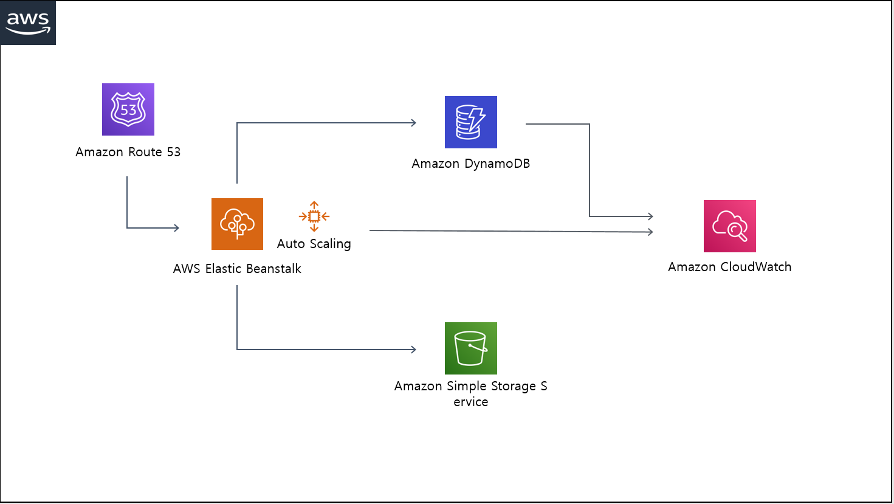

# SNUPA BACKEND
snupa backend

## Features
* Using Kotlin & Spring Boot
* Based on Clean Architecture
* Dockerize Application with EB
* Build CI / CD Pipeline with Jenkins

***

## Focus
* Low Latency
* Efficient Resource Management
* Stable Environment

***

## Architecture

***

## API

***

## Conclusion